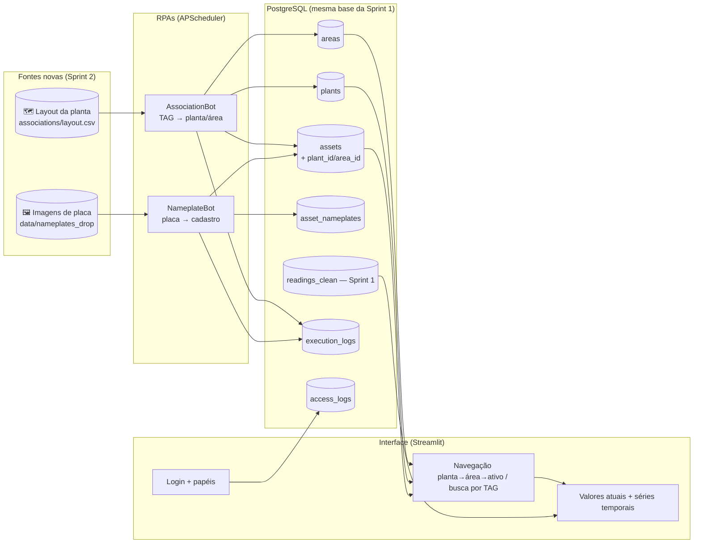
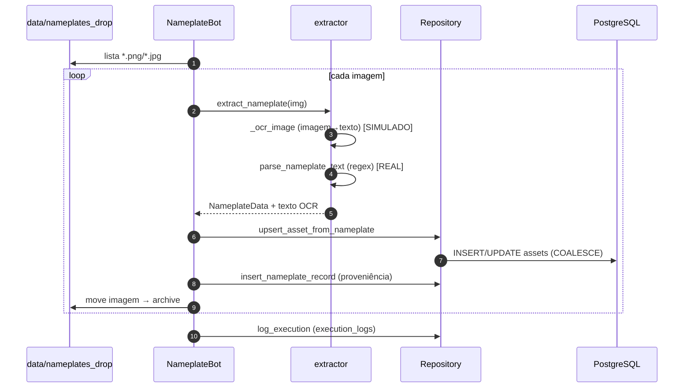

# Arquitetura — Sprint 2

## Visão geral

A Sprint 2 adiciona uma **camada de contextualização e visualização** sobre a base
técnica da Sprint 1. Nada da coleta é reescrito: a Sprint 2 conecta no mesmo
PostgreSQL e acrescenta hierarquia de planta, vínculo de localização, extração de
placa e a interface operacional.



## Componentes

| Módulo | Responsabilidade |
|---|---|
| `nameplate/extractor.py` | imagem da placa → texto (OCR simulado) → campos (regex real) |
| `nameplate/bot.py` | RPA: varre drop, extrai, preenche cadastro, arquiva, audita |
| `association/bot.py` | RPA: lê layout, upsert planta/área, vincula TAG à localização |
| `repository.py` | SQL das entidades novas + leitura de `readings_clean` |
| `orchestrator.py` | agenda as duas RPAs (cron) + warm-up + shutdown gracioso |
| `app/streamlit_app.py` | navegação, busca, dashboards, painel admin, auditoria |
| `app/auth.py` | login com papéis (SHA-256 salgado), sem dependências extras |
| `db.py` | conexão psycopg3 com retry + aplicador de migrations |

## Decisões técnicas (resumo)

1. **Estender, não duplicar.** A Sprint 2 só acrescenta tabelas/colunas via
   migration idempotente. Mantém uma fonte de verdade única para o cadastro e o
   histórico, evitando divergência entre sprints.
2. **Auditoria unificada.** As RPAs da Sprint 2 gravam em `execution_logs` — a
   mesma tabela da Sprint 1 — preservando rastreabilidade consistente.
3. **Localização estruturada + legada.** `assets.location` (texto livre da Sprint 1)
   é mantido; o vínculo navegável passa a ser `plant_id`/`area_id`. Migração suave.
4. **OCR isolado.** A única etapa simulada (imagem→texto) está numa função única,
   com o parsing real por regex já implementado — trocar por Tesseract é local.
5. **Idempotência.** Ambas as RPAs podem reexecutar sem efeito colateral
   (`ON CONFLICT`, `COALESCE`, comparação de estado antes de gravar).
6. **Versão única do Python (3.12)** e **src-layout** — resolve o feedback da
   Sprint 1 sobre ambiguidade de versão e estrutura de módulos antiga.

## Fluxo de uma execução (RPA de placa)



## Execução local (sem Docker)

Requer Python 3.12 e um PostgreSQL acessível (ajuste o `.env`).

```bash
python -m venv .venv && .venv\Scripts\activate    # Windows
pip install -r requirements.txt
$env:PYTHONPATH = "src"                              # PowerShell
python -m sprint2.main seed                           # migrations + demo
streamlit run src/sprint2/app/streamlit_app.py
```

> No Linux/Mac: `source .venv/bin/activate` e `export PYTHONPATH=src`.

## Escalabilidade

| Eixo | Hoje (MVP) | Evolução |
|---|---|---|
| Fontes de placa | pasta de drop local | bucket S3 + evento → fila |
| OCR | simulado (metadados PNG) | Tesseract/EasyOCR em `_ocr_image` |
| Multi-planta | `plants`/`areas` já modelam N plantas | filtro por planta na UI / RBAC por planta |
| Volume de RPAs | 1 processo + APScheduler | Celery/Prefect mantendo as classes de bot |
| Interface | Streamlit single-process | Grafana/Metabase sobre as mesmas views |
