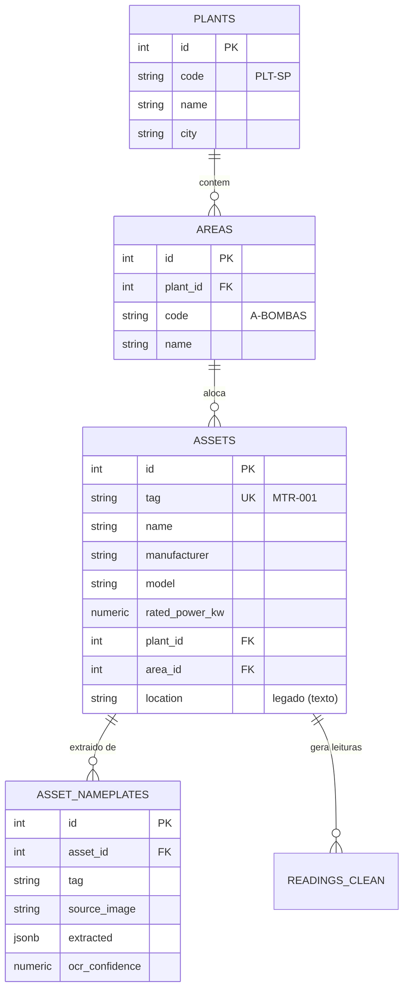

# Mapeamento Ativo ↔ TAG ↔ Localização

Este documento define o modelo de dados que garante a **consistência entre o
ativo físico, sua identificação (TAG) e sua localização na planta** — critério
central de avaliação da Sprint 2.

## Entidades e relacionamentos



## A TAG como chave de negócio

A **TAG** (ex.: `MTR-001`) é o identificador estável do ativo no chão de fábrica.
Ela é:

- **única** (`assets.tag UNIQUE`) — uma TAG = um ativo;
- a **chave natural** usada por todas as automações (idempotência por TAG);
- o **ponto de entrada da busca** na interface (“localizar equipamento pela TAG”);
- o elo entre o **mundo físico** (placa, etiqueta) e o **digital** (cadastro, leituras).

## Hierarquia de navegação

```
Planta (plants)
└── Área (areas)
    └── Ativo (assets, via area_id → e plant_id para acesso direto)
        ├── Placa  (asset_nameplates)
        └── Leituras (readings_clean)
```

A view **`v_navigation`** materializa a árvore com a contagem de ativos por
planta/área (usada pela barra lateral da interface).

A view **`v_asset_location`** entrega, por ativo, a tripla resolvida
**TAG · Planta · Área** (usada na busca por TAG e no detalhe do ativo).

## Como a associação é mantida (sem digitação manual)

A `AssociationBot` (RPA) consome um **CSV de layout** exportado da engenharia:

| coluna | exemplo | papel |
|---|---|---|
| `tag` | `MTR-001` | identifica o ativo |
| `plant_code` / `plant_name` | `PLT-SP` / Planta Sao Paulo | planta |
| `area_code` / `area_name` | `A-BOMBAS` / Bombeamento | área |

A cada execução o bot:

1. **garante** (upsert) plantas e áreas declaradas — `plants` / `areas`;
2. **vincula** `assets.plant_id` e `assets.area_id` pela TAG;
3. grava o resultado por linha: `LINKED` (vínculo novo/alterado),
   `UNCHANGED` (já estava correto) ou `NO_ASSET` (TAG ainda sem cadastro →
   pendência registrada em log).

A operação é **idempotente**: rodar de novo com o mesmo layout não muda nada
(`UNCHANGED`). Alterar a localização de uma TAG no CSV e reexecutar **reflete**
a mudança no cadastro automaticamente — é a “atualização sem input manual
repetitivo” exigida no enunciado.

## Tratamento de inconsistências

| Situação | Comportamento |
|---|---|
| TAG no layout sem ativo cadastrado | `NO_ASSET` — vínculo fica pendente, logado; resolve sozinho quando a placa daquela TAG for processada e o layout reexecutado |
| Planta/área do layout inexistente | criada no upsert antes do vínculo |
| Linha de layout malformada | descartada com `WARNING`; não derruba o lote (status `PARTIAL`) |
| Ativo já na localização correta | `UNCHANGED` — nenhuma escrita |

## Ordem de convergência (placa + associação)

No warm-up do orquestrador e no `seed`, a ordem garante consistência mesmo
partindo do zero:

1. **placa → cadastro** cria os ativos (TAGs passam a existir);
2. **associação** vincula cada TAG à sua planta/área;
3. reexecuções periódicas mantêm tudo convergido (idempotência).
