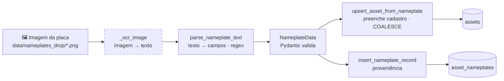

# Pipeline: da imagem da placa ao cadastro do ativo

Documento exigido pelo enunciado: *"definição clara do pipeline de dados — da
extração da imagem da placa até o preenchimento do cadastro do ativo"* e
*"processo de integração dos dados da placa no cadastro"*.

## Visão do pipeline



A etapa tracejada (**imagem → texto**) é a única **simulada**; todo o resto é real.

## Etapas

### 1. Entrada — imagem da placa
A RPA (`NameplateBot`) vigia `data/nameplates_drop/`. Cada `.png/.jpg` é uma placa
de motor. Para a demonstração, `tools/gen_nameplates.py` gera placas realistas
(fabricante, TAG, modelo, potência, tensão, corrente, rotação).

### 2. Extração de texto — `extractor._ocr_image` *(etapa simulada e isolada)*
Abre a imagem **de verdade** (PIL) e recupera o texto da placa.

**Por que simulada?** O enunciado pede para **definir o pipeline** e **automatizar
o preenchimento do cadastro** — não para construir um OCR de produção. Manter a
extração simulada deixa o pipeline 100% reprodutível e testável, sem dependência
de binário externo, **sem deixar de exercitar todo o restante do fluxo**.

**Como a simulação funciona:** na geração, o texto da placa é gravado nos
metadados PNG (`tEXt`). O `_ocr_image` lê esse texto — emulando um OCR perfeito.
A imagem continua sendo um arquivo de imagem legítimo.

### 3. Parsing — `extractor.parse_nameplate_text` *(etapa real)*
Aplica **expressões regulares tolerantes a ruído** sobre o texto, exatamente como
se faria sobre a saída de um OCR real:

| Campo | Padrão (resumo) | Observações |
|---|---|---|
| TAG | `TAG[:\s]+([A-Z0-9\-_]+)` | obrigatório; sem TAG → registro descartado |
| Modelo | `MOD(ELO)?[:\s]+(…)` | até o fim da linha |
| Fabricante | lista conhecida \| 1ª linha | WEG, Atlas Copco, Siemens, ABB… |
| Potência | `(\d+)\s*kW` \| `(\d+)\s*cv/hp` | cv/hp convertidos p/ kW (×0,7457) |
| Tensão | `(\d+)\s*V` | unidade colada ou separada |
| Corrente | `(\d+)\s*A` | |
| Rotação | `(\d+)\s*rpm` | |

A **confiança** (`ocr_confidence`) é a fração dos 6 campos técnicos reconhecidos
— um proxy de qualidade da leitura, persistido para auditoria.

### 4. Validação — `NameplateData` (Pydantic)
Os campos são forçados pelo schema (faixas físicas, padrão da TAG). Dados fora de
faixa ou TAG inválida são rejeitados **na fronteira**, antes de tocar o banco.

### 5. Preenchimento do cadastro — `upsert_asset_from_nameplate`
- TAG inédita → **INSERT** em `assets` (cria o ativo).
- TAG existente → **UPDATE** com `COALESCE` (a placa preenche lacunas e atualiza
  campos técnicos; um nome já definido não é sobrescrito por um genérico).
- **Não** mexe em localização — isso é função da RPA de associação. Separação de
  responsabilidades clara.

### 6. Proveniência — `asset_nameplates`
Cada extração registra: imagem de origem, **texto OCR**, **campos extraídos**
(JSONB), **confiança** e **quem/o quê** extraiu. Garante rastreabilidade e dá
material para treinar/avaliar um OCR real no futuro.

### 7. Arquivamento e auditoria
A imagem processada é movida para `data/nameplates_archive/` e a execução vira
uma linha em `execution_logs` (status, contagens, duração).

## Trocar por OCR real (caminho de evolução)

A troca é **local**, em `extractor._ocr_image`:

```python
import pytesseract
from PIL import Image

def _ocr_image(image_path: str) -> str:
    return pytesseract.image_to_string(Image.open(image_path), lang="por")
```

E no Docker, adicionar o binário:

```dockerfile
RUN apt-get update && apt-get install -y --no-install-recommends \
        tesseract-ocr tesseract-ocr-por && rm -rf /var/lib/apt/lists/*
```

`parse_nameplate_text`, a validação, o cadastro e a proveniência **não mudam** —
foi o motivo de isolar a leitura da imagem em uma função única.

## Vínculo com o Digital Twin

O cadastro preenchido pela placa (potência, tensão, corrente, rotação nominais)
é a **representação técnica** do ativo. Na interface, esses valores nominais
aparecem ao lado das **leituras atuais** de `readings_clean` — permitindo
comparar o comportamento real do motor com sua especificação de placa. É a base
para, em sprints futuras, detectar desvios (sobrecarga, sobreaquecimento) sobre
o gêmeo digital.
